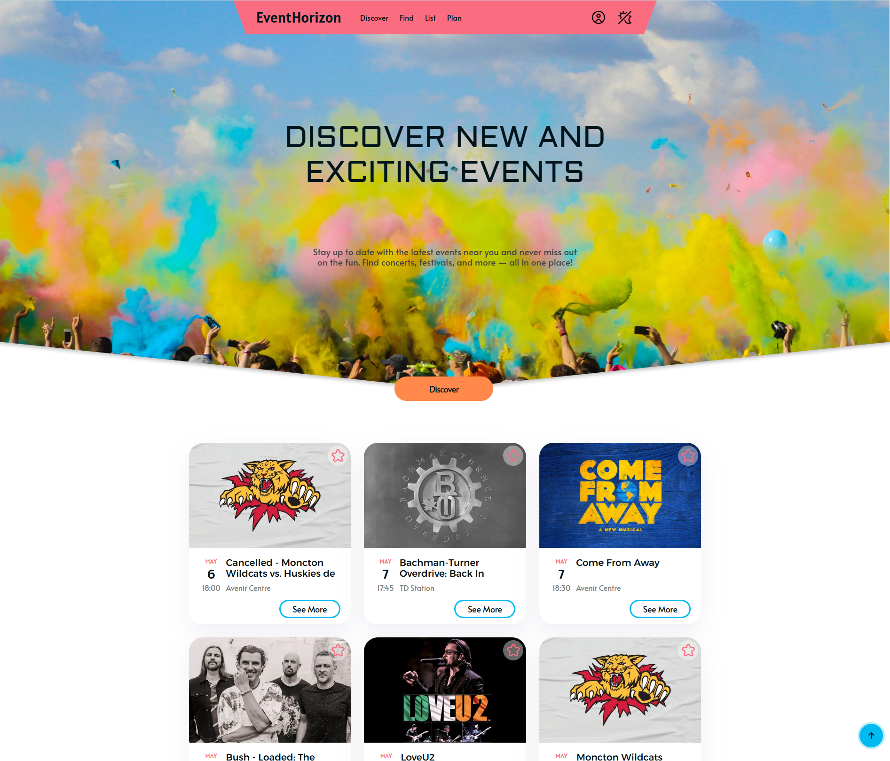
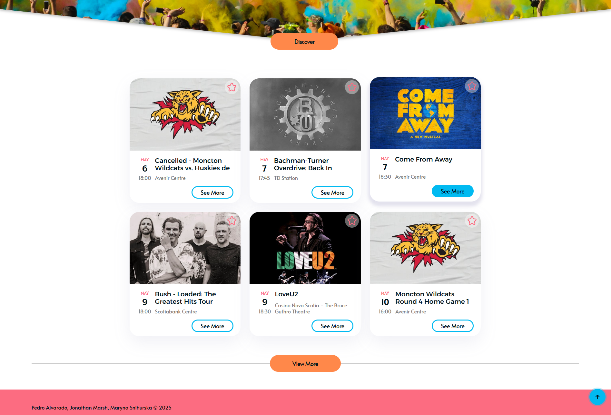
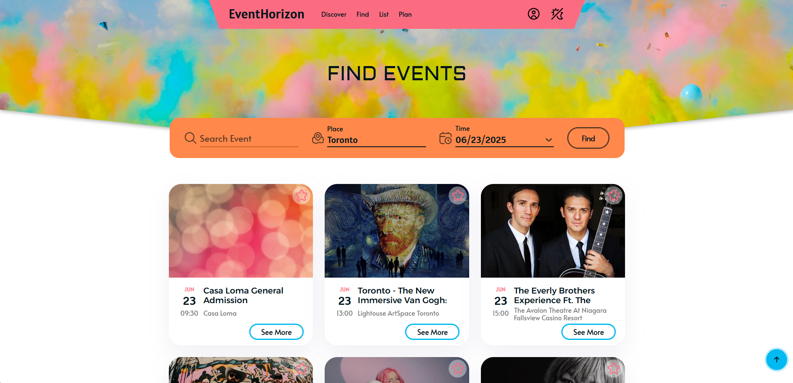
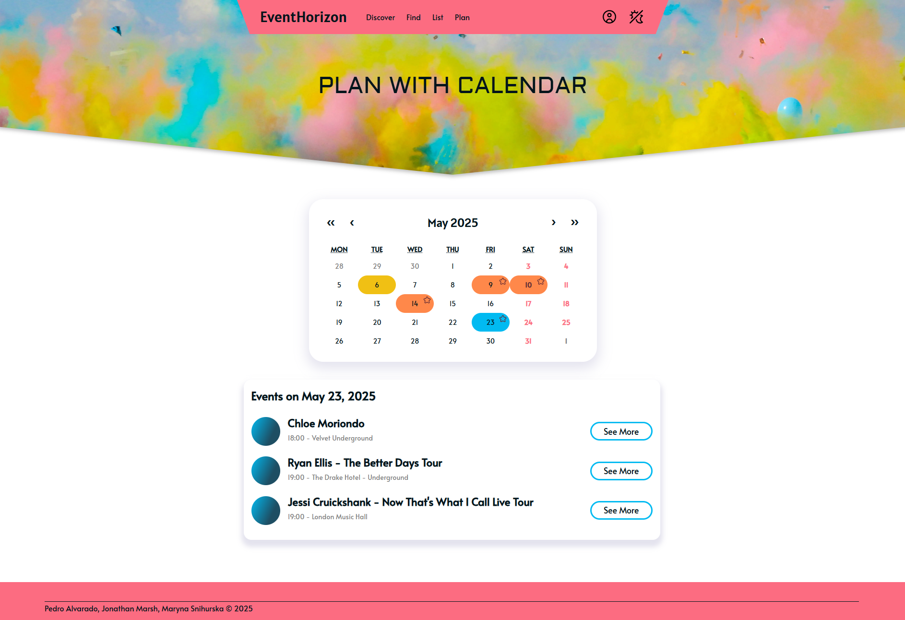
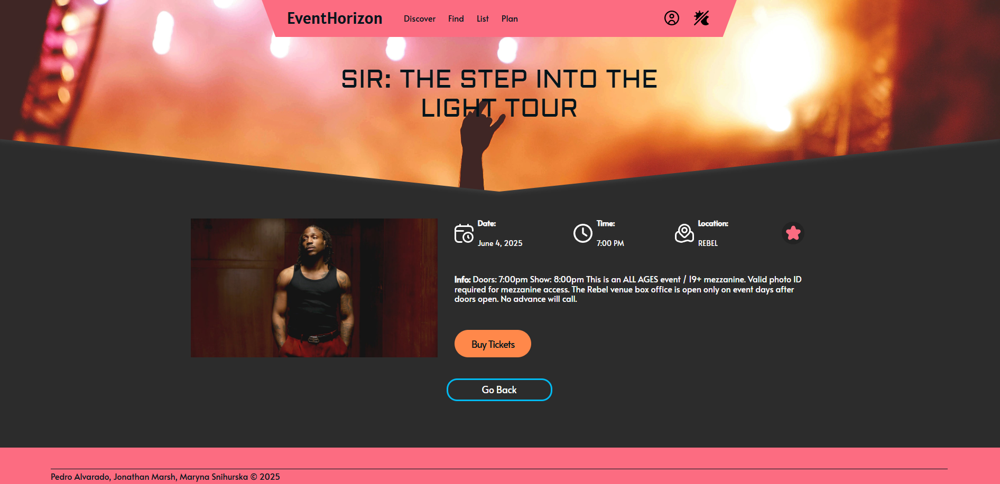

# EventHorizon – Event Tracker Web App

A modern, full-stack event tracking web application built with **React**, **Next.js (App Router)**, **Prisma**, and **PostgreSQL**, deployed via **Vercel** with the database hosted on **Neon**.

Originally developed as a college project, this app has grown into a showcase of technical proficiency with full-stack web development, third-party APIs (Ticketmaster Discovery v2), and user experience design.



> ⚠️ This app is for demonstration purposes. Please do **not** use real email addresses or passwords when signing up.

## Key Features

### Discover Events
The main (landing) page fetches and displays all upcoming events in **Canada** by default, using the Ticketmaster Discovery API.



### Search Events
Search for events by:
- **Event Name**
- **City**
- **Date** (shows results from selected date and onward)

Only one search field is required to perform a search.



### Favorites System
Mark events as favorites using a heart icon on event cards. Favorited events:
- Are stored in `localStorage`
- Appear in the **List** and **Plan** pages
- Can be unfavorited instantly (UI updates immediately)

### Calendar View
The **Plan** page includes:
- A calendar (`react-calendar`) that highlights dates with favorited events
- An event viewer below the calendar for the selected date



### Authentication
- Basic sign-up and login functionality (credentials stored in Neon PostgreSQL via Prisma)
- Includes session check logic to route users appropriately (e.g., Profile page will redirect to Sign-In if not logged in)

⚠️ **Important:** This is a prototype. Do not use real credentials.

### User Profile & Proof-of-Concept Admin Fetch
- Profile displays username and allows fetching a list of all users from the database
- Meant to demonstrate database connectivity and server-side functionality

### Dynamic Routing
- Clicking "See More" on an event card routes to a dedicated dynamic event page
- Includes event details, favorite button, and a link to buy tickets via Ticketmaster
- Other dynamic routes:
  - Profile page → routes to sign-in or user dashboard depending on auth state
  - "Go Back" button → navigates using browser history

### Responsive Design
- Event cards adjust layout for different screen sizes
- Interactive UI with dynamic button states and smooth transitions

### Dark Mode

The application includes a responsive **dark mode** toggle for improved user experience and accessibility.  

- Accessible from the navigation bar
- Switches UI elements and background colors for a comfortable viewing experience in low-light environments
- Seamlessly integrates with all pages and components



## Technologies Used

| Layer         | Technology                      |
|---------------|----------------------------------|
| Frontend      | React, Next.js (App Router)     |
| Backend       | Prisma, API routes in Next.js   |
| Database      | PostgreSQL (Neon), Prisma ORM   |
| UI Components | react-calendar                  |
| Hosting       | Vercel (App), Neon (DB)         |
| API           | Ticketmaster Discovery v2       |

## Getting Started (Local Development)

You can access all user-facing features of the web app directly through the live deployment on [Vercel](https://event-tracker-project-five.vercel.app).  
This section is for developers who want to run the project **locally** for development or contribution purposes.

**1. Clone the Repository**

**2. Install Dependencies**
```bash
npm install
```
**3. Setup Environment Variables**
Create a `.env` file in the root:


```env
# .env
DATABASE_URL="your_postgres_connection_string"
NEXT_PUBLIC_API_KEY="your_ticketmaster_api_key"
```

Refer to `.env.example` for structure.  
> 💡 For local development without PostgreSQL, you can configure `DATABASE_URL` to use SQLite instead (see [Prisma Docs](https://www.prisma.io/docs)).

**4. Push Prisma Schema**

```bash
npx prisma db push
```

**5. Run the App**

```bash
npm run dev
```

## ⚠️ Disclaimer

This project is for educational and portfolio purposes only. No sensitive data should be entered.  

All rights to event data belong to [Ticketmaster](https://developer.ticketmaster.com/).

## Feedback and Issues
If you encounter any issues with this Dashboard Project or have suggestions for improvements, please open an issue on the GitHub repository. Your feedback is valuable and will help make this project even better.

### Known Issues
**Anchor History Collision:** Browser history can cause "Go Back" to be ineffective if the last navigation was an anchor link (e.g., `#top`). A second click usually resolves this.

## Credits

This project was created with passion by Maryna Snihurska (aka RinaSatsu), Pedro Alvarado, Jonathan Marsh.

## License

MIT License – feel free to fork and build on this project.
